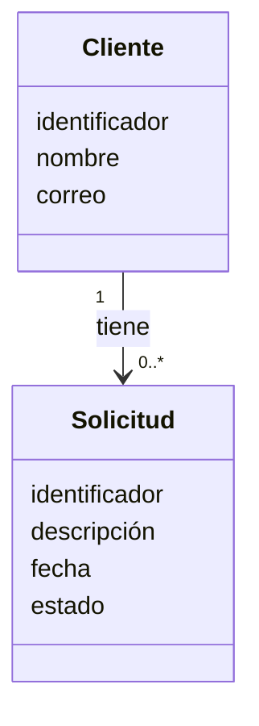
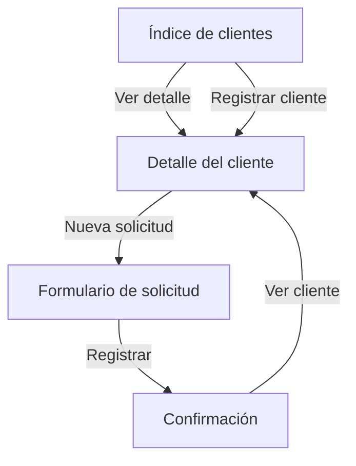

# Aplicación de OOHDM

## Requisitos utilizados como insumo

**Actor:** auxiliar de soporte, sin autenticación.

- Registrar y consultar clientes.
- Registrar solicitudes vinculadas con un cliente existente.
- Exigir la descripción del problema.
- Asignar desde el servidor la fecha y el estado inicial `Pendiente`.
- Comprobar que el cliente exista.
- Generar un identificador para cada registro.

## 1. Diseño conceptual

El dominio contiene dos clases conceptuales:



Un cliente puede tener cero o muchas solicitudes. Cada solicitud pertenece exactamente a un cliente.

## 2. Diseño navegacional

| Elemento | Tipo | Información o función |
|---|---|---|
| Índice de clientes | Estructura de acceso | Permite localizar o registrar clientes |
| Detalle del cliente | Nodo | Presenta identificador, nombre, correo y solicitudes |
| Nueva solicitud | Nodo | Conserva el cliente seleccionado y recibe la descripción |
| Confirmación | Nodo | Presenta el identificador, la fecha y el estado generado |



El identificador se incorpora en el enlace `/clientes/:id/solicitudes/nueva` y después viaja en un campo oculto. El usuario no escribe el identificador ni repite el nombre y el correo.

## 3. Diseño de interfaz abstracta

### Nodo: índice de clientes

- Información visible: nombre, identificador y correo.
- Controles: enlace al detalle y enlace para registrar cliente.
- Respuesta: muestra el nodo seleccionado o el formulario de registro.

### Nodo: nueva solicitud

- Información visible: identificador y nombre del cliente seleccionado.
- Control: área de texto obligatoria para describir el problema.
- Evento: envío de `POST /solicitudes`.
- Respuesta correcta: identificador generado, fecha y estado inicial.
- Respuesta de error: mensaje si falta la descripción o el cliente no existe.

Los colores y la distribución visual pertenecen a la implementación, no a esta especificación abstracta.

## 4. Implementación

| Decisión de diseño | Materialización |
|---|---|
| Cliente y Solicitud | Tablas `clientes` y `solicitudes` |
| Relación 1 a 0..* | `solicitudes.cliente_id` como clave foránea |
| Índice de clientes | `GET /clientes` |
| Detalle de un cliente | `GET /clientes/:id` |
| Nueva solicitud | `GET /clientes/:id/solicitudes/nueva` |
| Registro de solicitud | `POST /solicitudes` |
| Respuestas del usuario | HTML generado por el servidor |
| Presentación | `public/styles.css` |

### Esquema físico de SQLite

```sql
CREATE TABLE clientes (
  id INTEGER PRIMARY KEY AUTOINCREMENT,
  nombre TEXT NOT NULL,
  correo TEXT NOT NULL UNIQUE
);

CREATE TABLE solicitudes (
  id INTEGER PRIMARY KEY AUTOINCREMENT,
  cliente_id INTEGER NOT NULL,
  descripcion TEXT NOT NULL,
  fecha TEXT NOT NULL,
  estado TEXT NOT NULL DEFAULT 'Pendiente',
  FOREIGN KEY (cliente_id) REFERENCES clientes(id)
);
```

## Correspondencia principal

OOHDM no obliga a crear clases de JavaScript. Las clases conceptuales se materializan aquí mediante tablas, consultas SQL, rutas HTTP y funciones del servidor.
